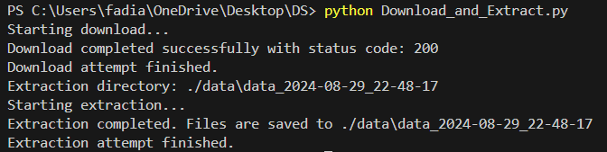
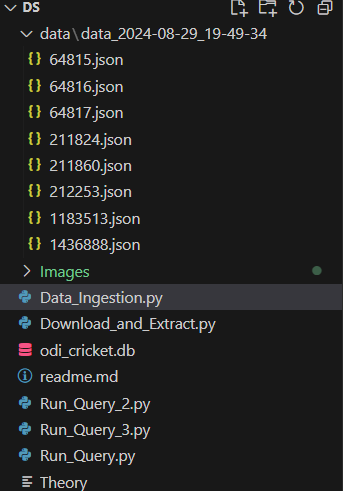
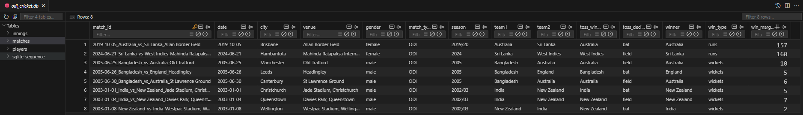
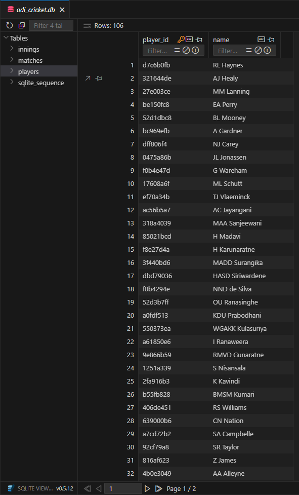
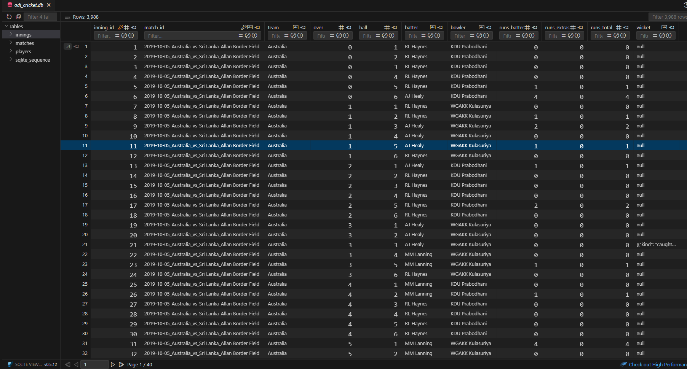
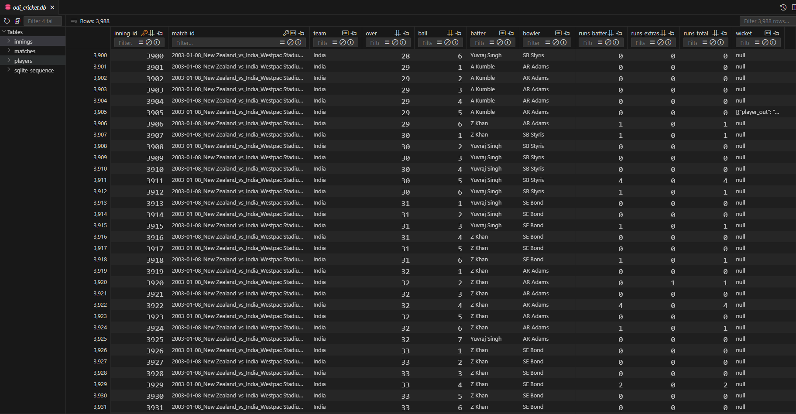
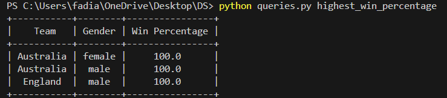
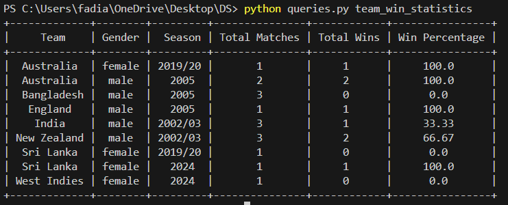
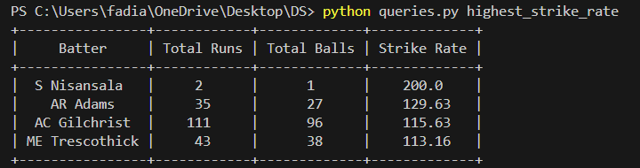

# ODI Cricket Data Analysis

## Overview

This project is designed to facilitate the analysis of One Day International (ODI) cricket match data. It includes Python scripts for downloading and extracting data, data ingestion, processing, and querying within an SQLite database, enabling users to derive meaningful insights from historical cricket data.

## Project Structure
 
- `data/`: Directory containing raw datasets (JSON files) related to ODI cricket matches.

- Python Scripts:
  - `download_and_extract.py`: Automates the downloading and extraction of cricket match data, preparing it for ingestion into the database.
  - `database_creation_&_data_ingestion.py`: Handles the ingestion of cricket match data into the SQLite database (`odi_cricket.db`). This script structures the data for efficient querying and analysis.
  - `queries.py`: Executes a set of predefined SQL queries to extract insights from the database.

- Database:
  - `odi_cricket.db`: The SQLite database file where the ingested cricket data is stored. This database is structured to support efficient data retrieval and complex querying.

- Documentation:
  - `Theory/`: Contains the answers of Question 0, Question 4, Question 5.

## Getting Started 

### 1. Prerequisites

Before you begin, ensure you have the following installed on your system:
- Python 3
- SQLite3
- Required Python libraries (specified in `requirements.txt`)

Install the necessary dependencies with:
```bash
pip install -r requirements.txt
```

### 2. Data Preparation

Run the Download_and_Extract.py script to download and extract the cricket match data:
```bash
python download_and_extract.py
```



### 3. Database Creation & Data Ingestion

Use the Data_Ingestion.py script to create tables if doesn't exist and ingest the extracted data into the SQLite database:
```bash
python database_creation_&_data_ingestion.py
```
Matches Table


Players Table



Innings Table




### 4. Data Analysis

You can run the following scripts to perform specific analyses on the ingested data:

First Queries:
```bash
python queries.py highest_win_percentage
```


Second Queries:
```bash
python queries.py team_win_statistics
```


Third Queries:
```bash
python queries.py highest_strike_rate 
```



## Author
- Aayush Fadia
